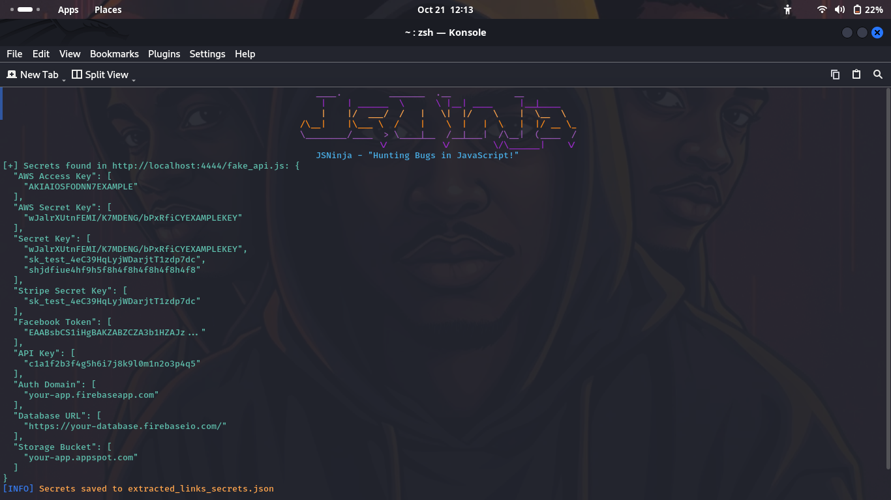

<p align="left">
</p>
<p align="center">
<a href="#"></a>
<a href="https://www.python.org/"></a>
<a href="https://github.com/iamunixtz/JSNinja/stargazers"></a>
<a href="https://github.com/iamunixtz/JSNinja/issues"></a>
</p>

# JSNinja - "Hunting Bugs in JavaScript!"

JSNinja is a powerful tool for extracting URLs and sensitive information from JavaScript files. It's designed for security enthusiasts, bug hunters, and developers.

<p align="center">

</p>

## Installation:

To install JSNinja, run the following commands:

```bash
apt update
apt install git python3 python3-pip -y
git clone https://github.com/iamunixtz/JSNinja.git
cd JSNinja
pip3 install -r requirements.txt
sudo cp jsninja /usr/local/bin
jsninja -h
```

### Single Command:

```bash
apt update ; apt install git python3 python3-pip -y ; git clone https://github.com/iamunixtz/JSNinja.git ; cd JSNinja ; pip3 install -r requirements.txt ; sudo cp jsninja /usr/local/bin ;jsninja -h
```

<br>

## Usage:

To run JSNinja, use the following command:

```bash
python3 jsninja.py -u http://example.com/script.js --secrets --urls
```

### Command-Line Options:
- `-u` or `--url`: Specify a single JavaScript URL to fetch.
- `--secrets`: Look for sensitive information in the JavaScript content.
- `--urls`: Extract URLs from the JavaScript content.
- `-o` or `--output_file`: Specify the file to save extracted links (default: `extracted_links.txt`).

## Features:
- [x] Extract URLs from JavaScript files!
- [x] Identify sensitive information such as API keys and tokens!
- [x] User-friendly interface!
- [x] Open Source and actively maintained!
- [x] **API Key Detection**: Detects API keys and secrets such as AWS, Google, Stripe, and more.

## Available API Regex:  
- [x] **AWS Access Key**: Detects AWS Access Key IDs.
- [x] **AWS Secret Key**: Detects AWS Secret Access Keys.
- [x] **Google API Key**: Detects Google API keys (Maps, Firebase, etc.).
- [x] **Stripe API Key**: Detects Stripe Secret API keys.
- [x] **GitHub Token**: Detects GitHub API tokens.
- [x] **Twilio API Key**: Detects Twilio Account SID and Auth Token.
- [x] **Facebook Access Token**: Detects Facebook API access tokens.
- [x] **GitLab Token**: Detects GitLab personal access tokens.
- [x] **Telegram Bot Token**: Detects Telegram bot API tokens.
- [x] **API Key for Services**: Detects other generic API keys with the format `API Key: <key>`.
- [x] **API Token**: Detects API tokens in general formats.
- [x] **Google Maps API Key**: Detects Google Maps API keys.
- [x] **Stripe Secret Key**: Detects Stripe secret keys with specific formats.
- [x] **GitHub Personal Access Token**: Captures GitHub personal access tokens.
- [x] **AWS IAM Key**: Detects IAM keys for AWS access.
- [x] **Facebook App Secret**: Detects Facebook App secrets.
- [x] **Telegram Bot API Token**: Detects Telegram bot tokens.
- [x] **Dropbox API Key**: Detects Dropbox API keys.
- [x] **Google reCAPTCHA Key**: Detects Google reCAPTCHA keys.
- [x] **General API** : Detects all genereal api keys.

## Upcoming Features:
- [ ] **API Endpoints in JavaScript Files**: The tool will be enhanced to automatically detect and extract API endpoints within JavaScript files.
- [ ] **Hidden Parameters**: The tool will scan JavaScript files for hidden parameters and keys that may be obfuscated or dynamically generated.

## Credits:
#### > [Iamunixtz](https://github.com/iamunixtz)
#### > Inspired by various open-source projects!

## License:
This project is licensed under the MIT License - see the [LICENSE](LICENSE) file for details.
```
