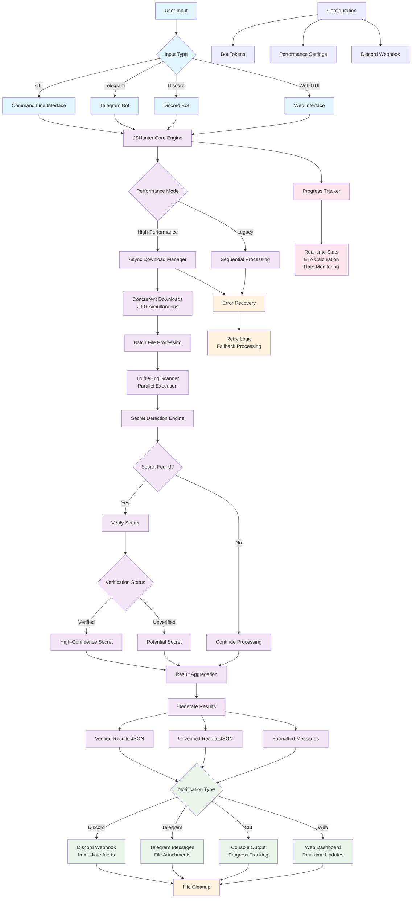

# JSHunter Workflow Diagram

## Workflow Description

### 1. **Input Layer**
- **CLI**: Direct command-line usage with file or URL input
- **Telegram Bot**: Interactive bot with `/scanurl` and file upload commands
- **Discord Bot**: Server-based bot with `!scanurl` and file attachment support
- **Web GUI**: Browser-based interface for easy access

### 2. **Configuration Management**
- Bot tokens and API keys stored securely
- Performance tuning parameters
- Discord webhook URLs for notifications

### 3. **Core Processing Engine**
- **High-Performance Mode**: Async downloads, parallel processing, batch operations
- **Legacy Mode**: Sequential processing for small batches
- **Adaptive Selection**: Automatically chooses optimal mode based on input size

### 4. **Download & Processing Pipeline**
- **Concurrent Downloads**: 200+ simultaneous HTTP requests
- **Batch Processing**: Groups files for efficient TruffleHog scanning
- **Parallel Execution**: Multiple TruffleHog instances running simultaneously

### 5. **Secret Detection & Verification**
- **TruffleHog Integration**: Industry-standard secret detection
- **Verification Process**: API validation for high-confidence results
- **Classification**: Separates verified from unverified findings

### 6. **Result Generation**
- **JSON Output**: Structured data for programmatic access
- **Formatted Messages**: Human-readable output with full API keys
- **File Attachments**: Complete result files for detailed analysis

### 7. **Multi-Channel Notifications**
- **Discord**: Immediate webhook alerts for verified secrets
- **Telegram**: Rich messages with file attachments
- **CLI**: Real-time progress and console output
- **Web**: Live dashboard updates

### 8. **Performance Monitoring**
- **Real-time Stats**: Progress tracking with ETA
- **Rate Monitoring**: Throughput and success rate metrics
- **Error Recovery**: Automatic retry and fallback mechanisms

### 9. **Resource Management**
- **File Cleanup**: Automatic removal of temporary files
- **Memory Optimization**: Efficient handling of large datasets
- **Connection Pooling**: Optimized HTTP client management
